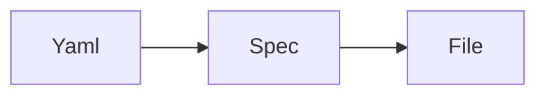
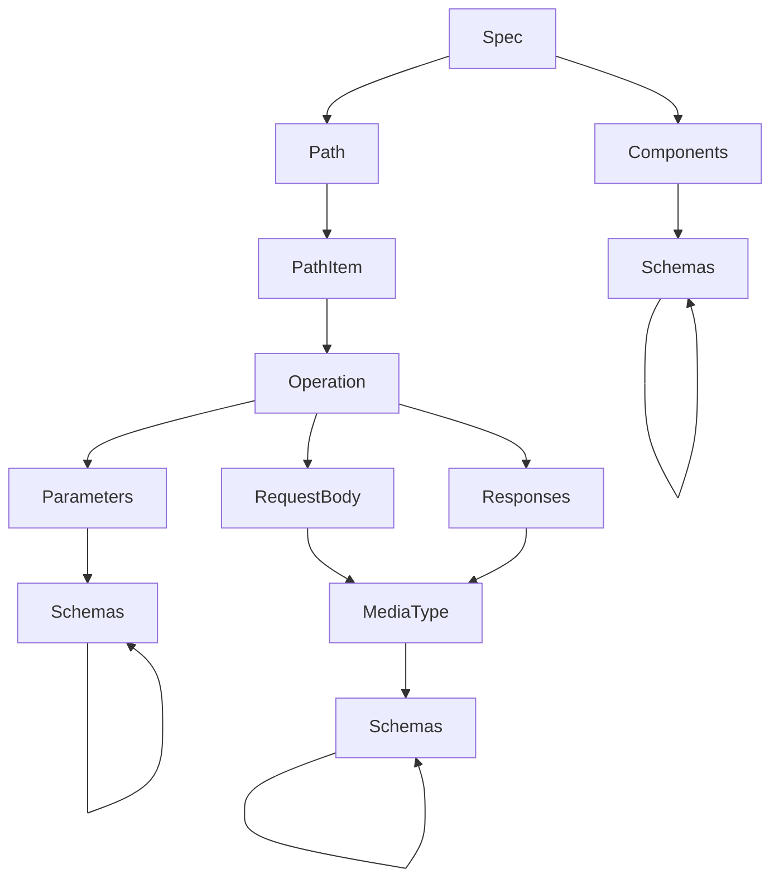
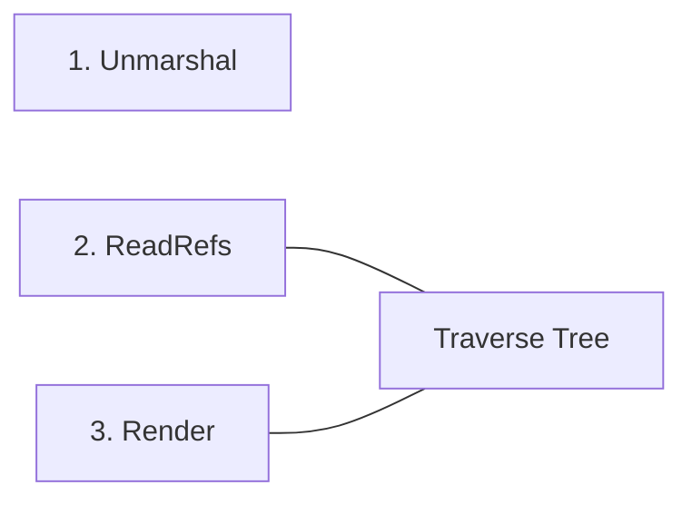
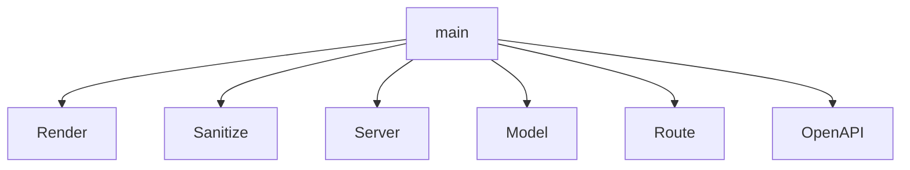

# gin-in-a-can

[The existing openapi generator for Gin](https://openapi-generator.tech/docs/generators/go-gin-server)  is decent, but it lacks certain features that I need.
Ideally, I would contribute to it directly, but I need this sooner than I am able to learn how their build system, etc. work.

The features I need are:
* To be able to register an existing gin Engine with predefined middleware.
* To be able to use the generated code without modifying it.

## TODO
* use components to avoid duplicate ref structs
* use nullable types in parameters and request bodies
* Add parameter validation based on the `required` flag, regex patterns and other OpenAPI format specifications
* Add API Fuzz testing

# HackDay Plans


```go 
type File struct {
    content []byte
    path    string
}
```

## OpenAPI spec - _Can_ tree representation


## Process Representation


Spec is a Directed Acyclic Graph of composed nodes:
```go 
type Node struct {
    outputPath  string
    fileName    string 
    content     []byte
    parent      *Node
    children    []Node
}
```

## Can Package Structure

