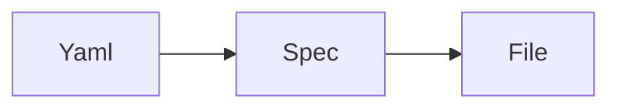
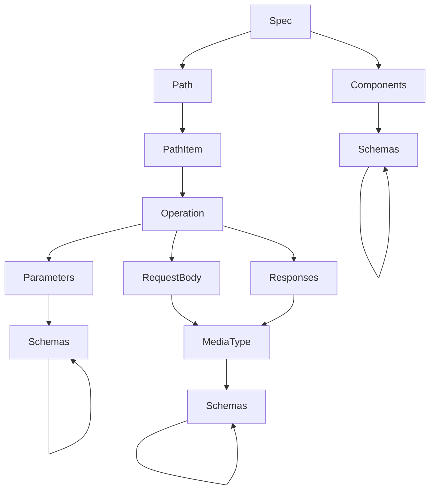
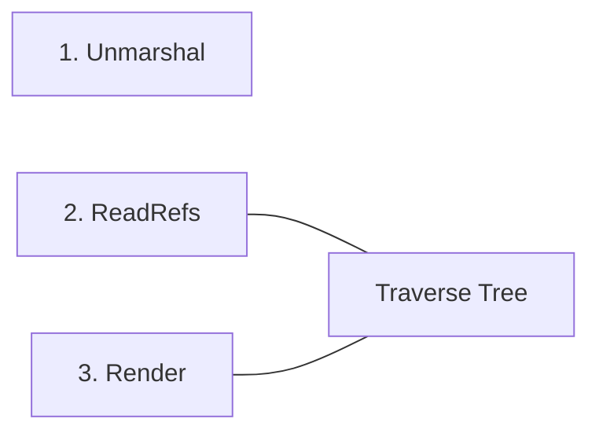
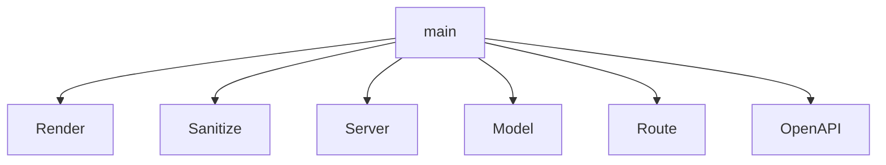

# Design


```go 
type File struct {
    content []byte
    path    string
}
```

## OpenAPI spec - _Can_ tree representation


## Process Representation


Spec is a Directed Acyclic Graph of composed nodes.

## Can Package Structure

